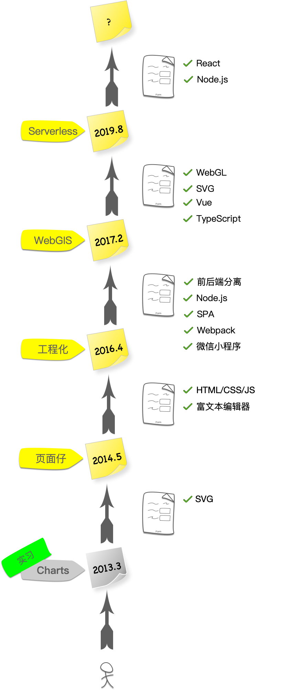

# 前端知识库

此仓库是总结本人自2014年从业以来所涉猎的技术，由于涉及业务场景的差异化以及技术深度的不同，各项技术所罗列细节的仅仅是本人已接触或特别研究过的，不能覆盖所有方面。

此仓库仅当记录，别无他用。

## 技术路线

- 2013年3月读研期间加入SAP上海研究院实习，工作内容主要是基于SVG的Charts library；
- 2014年5月校招加入优酷，前期以写页面为主，后期涉及富文本编辑器；
- 2016年4月加入58到家，精力集中到前端工程化、前后端分离以及少数业务层（H5/小程序）开发；
- 2017年2月加入搜狗地图，大概一半时间聚焦常规Web业务（主要是Vue），一半时间图形编程（SVG/WebGL）；
- 2019年9月加入腾讯，截止到目前的工作内容侧重系统设计，具体涉及技术以React/Node.js为主。

根据以上技术路线，此仓库将重点记录下列几个技术和细节（待完善）。

### 基础知识
基础知识主要集中在HTML5和JavaScript。
#### HTML5
在HTML5的诸多新特性中，我个人曾使用最多涉猎最深入的只有Web Woker：
- 主从多线程模型
- worker线程管理
  - 通信
  - Actor模型
- 安全沙箱

#### JavaScript
JavaScript语言本身的核心难点主要体现在异步以及围绕异步展开的各项延伸：
- 异步
- Generator
- Promise

JavaScript非常灵活，元编程这个词虽然看上去挺陌生，但实际工作中的应用频率非常高：
- 元编程

#### Node.js服务编程
使用Node.js开发Web Server的难点并不仅仅是Node.js本身，首先需要具备一定的服务端开发知识：
- 网络
  - HTTP(S)
  - TCP
  - WebSocket
- 并发&QPS
- 授权
  - OAuth
  - 单点登录
- 消息队列
- 缓存
  - Redis
  - LRU算法
- 安全
  - 加密
    - 对称加密
    - 非对称加密
  - 协议
    - TLS/SSL
  - 攻防
    - XSS
    - CSRF
    - 中间人

然后再结合Node.js本身的特性：
- 异步
  - Promise
  - Event Loop
  - Timmer
  - CLS问题
- 子程序
- 框架
  - Koa
  - Express
- IO
  - Buffer
  - Stream
- 部署
  - 集群
  - 负载均衡
- 监控
  - 守护进程
  - 进程通信
  - CPU负载
- 测试
  - 单元测试
  - 压力测试
  - 基准测试

### 框架
我个人只用过Vue和React：
- Vue
- React

以及相关生态和理论：
- VDOM
- Diff
- Redux
  - Flux
  - Redux Saga

### 工具
从Webpack v1就开始接触，现在已经迭代到v4了：
- Webpack

以及越来越流行的TypeScript：
- TypeScript

### 工程化
- 持续集成
- 监控预警
  - 端侧
  - Node.js
- 性能优化
  - 常规Web项目
  - WebGL
- 日志
- 数据统计

### 图形编程
图形编程对前端来说是一个相对小众的垂直领域，虽然前端几乎每天都在跟图形打交道，但基于 HTML和CSS 的UI图形是非常便捷的图形编程技术，而便捷的同时也有可定制化稍弱的缺陷。

在图形编程领域，图元通常被理解为开发者能够操控的最小、最基本的图形元素，图元种类越多、单位越小意味着可定制化的空间越大。CSS 的图元只有一种：矩形，称之为 CSS 盒模型。传统前端的页面是一个个盒子拼接起来的。

SVG 是比 CSS 更底层的图形编程技术，而且是矢量的。现实中对 SVG 最常见的使用场景是用作字体图标-font icons，主要发挥的是它矢量化的优势。但其实 SVG 的功能非常丰富，CSS 的很多能力都是借鉴的 SVG，比如`transform`。以及动态性也远大于 CSS，比如组件复用（Web Components规范与 SVG 非常接近）等等。除了font icons以外， SVG 最常用的场景是Charts。
- SVG
  - 基本图元
  - 原始的`transform`
  - 组件复用-`use`与`xlink`
  - 复杂应用实践：搜狗地铁图

Canvas是比SVG更底层的图形编程技术，分为两种：2D 和 3D（WebGL）。2D 是相对上层的技术，顾名思义只有 X 轴和 Y 轴，图元有两种：矩形（rect）和路径（path）。Canvas 2D提供了丰富的路径绘制API，比如圆弧、贝塞尔曲线。以及一些坐标操作的API，比如translate、rotate等等。我对Canvas 2D的使用并不多，没有太深入的经验，主要是集中在 Canvas 3D - WebGL上。

WebGL是前端范畴内最底层的图形编程技术，也是最接近图形学理论的技术，目前有部分高校把WebGL作为图形学的教学媒介了（以前普遍是OpenGL）。

- WebGL
  - 基本图元
  - 渲染管线
    - 从CPU到GPU
    - 仿射变换
      - 正向投影
      - 透视投影
    - 数学
      - 矩阵
      - 向量
      - 笛卡尔坐标
      - 三角剖分
    - shader 编程
      - 数据 - attribute、uniform、varying
      - buffer
    - 抗锯齿
      - 锯齿产生的原因
      - FXAA
    - 纹理
      - 数据纹理
      - 图像纹理
      - 多重纹理
    - 相机
  - 交互
    - 最原始的transform-矩阵
  - 性能优化
    - CPU
      - TypedArray
      - GC
      - 数据整合
    - GPU
      - stencil test
      - z-buffer
      - attribute与uniform
  - 最佳实践
    - web worker多线程
    - webassembly
    - 搜狗地图WebGL引擎架构

### Serverless
- FaaS

### 行业知识
- WebGIS
  - 坐标体系
  - GeoJSON
  - 墨卡托投影
  - 瓦片
    - 坐标
      - 经纬度
      - 墨卡托坐标
      - 屏幕坐标
      - 瓦片坐标
        - x
        - y
        - level
    - 数据
      - 瓦片金字塔
      - 瓦片切割
        - 陆地、海洋
        - 建筑物
        - 跨瓦片数据
      - 视野-bound
  - POI
    - 布局
    - 冲突检测
      - R-tree算法
